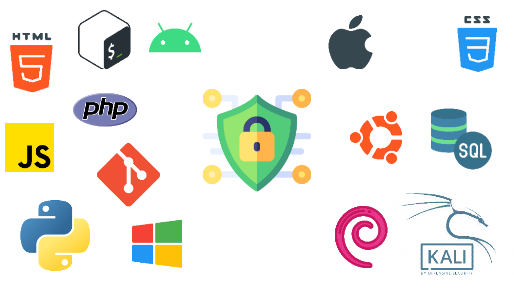
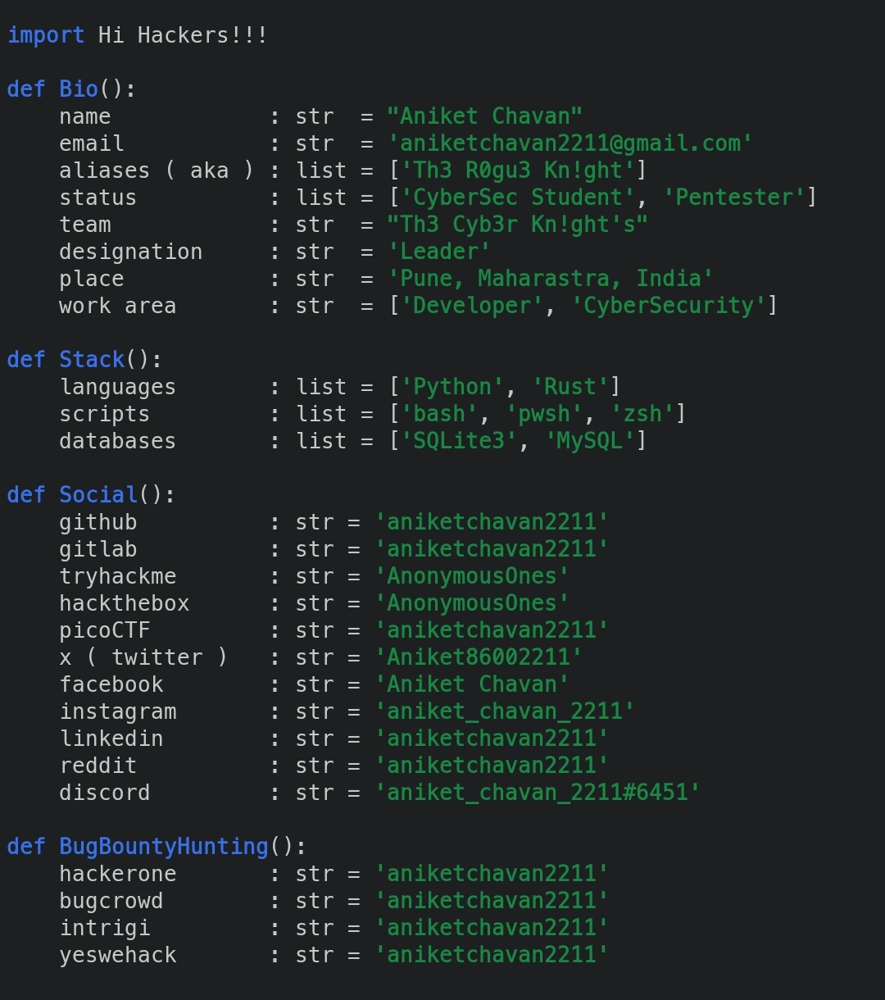

# 👋 Hello, Friend !!!

🚀 I’m a passionate cybersecurity professional and developer based in Maharashtra, India, actively involved in red/blue/purple team operations and open-source security projects. I build tools and applications at the intersection of offense & defense, especially leveraging AI/ML in security, Web & App development, and network/cloud infrastructure.

- 🔭 **Current Focus:** Building AI-driven security tooling and automating pentesting & SOC workflows.  
- 🌱 **Learning:** Offensive AI, Defensive AI, IoT/Hardware security, and advanced cloud/native security (Docker, Kubernetes).  
- 🤝 **Collaboration:** Open to bug bounty programs, CTF challenges, cybercrime investigation projects, and security research partnerships.  
- 💬 **Ask me about:** Web App & Mobile App security, Linux/Mac/Windows/Android/iOS security, network penetration, cloud & IoT security, malware/exploit development, and secure coding in Python/Rust/C/C++.  

## Bio 

## 🔑 Key Projects  

- **Password-Manager (PassMe)** – A secure password manager tool written in Python (uses industry-standard Fernet encryption). It can generate and store strong passwords safely.  
- **Rusty-Nmap** – A fast asynchronous port scanner in Rust, inspired by Nmap. It supports TCP/UDP scans, host discovery, and concurrent scanning with smart payloads.  
- **Onion-Sites** – A privacy-focused news website (Tor hidden service) written in Rust. It’s a static, read-only news feed with a security-first design (strict validation, security headers, minimal attack surface).  
- **CyberSec-Tools** – A toolkit repository containing various security utilities (TCP port scanners, keyloggers, vulnerability scanners, hash crackers, steganography tools, etc.) written in Python and C. It’s a sandbox for experimenting with offensive and defensive security code.  
- **AI & ML Projects** – A collection of Rust-based AI/ML prototypes (e.g. a vector/matrix math engine) and extensive notes on AI, ML, Deep Learning, Data Science, LLMs, NLP, Big Data, etc. (see the *Artificial-Intelligence* repository for comprehensive learning materials on these topics).  
- **CTF Write-ups** – Write-ups and reports from Capture-The-Flag competitions (TryHackMe, HackTheBox, picoCTF, OverTheWire/Wargames, etc.). Shares solutions, white papers, and vulnerability analyses from CTF challenges.  
- **Russian-Roulette (Game)** – A terminal-based multiplayer Russian Roulette game written in Rust. It features a text-based UI using the `ratatui` crate and real-time key handling (no Enter key needed).  

Each project above is open-source and reflects my interests in cybersecurity, system programming, and development. You can explore their code and documentation on my profile. 

## 🛠️ Skills & Technologies  

- **Programming & Scripting:** Python, Rust, C/C++, Go, JavaScript/TypeScript, Bash, Zsh. Familiar with frameworks like Django/Flask, React, Node.js.  
- **Security Domains:** Network/Web/Mobile/Cloud/IoT security, Penetration Testing, Vulnerability Assessment, SOC operations, Digital Forensics, Malware/Exploit Development.  
- **Tools & Platforms:** Nmap, Burp Suite, Metasploit, Wireshark, SQLMap, Git, Docker, Kubernetes, Azure/AWS/GCP.  
- **Systems:** Linux (Kali, Debian/Ubuntu, Alpine), Windows, MacOS, Android, Embedded systems. Experience with virtualization (VMware, VirtualBox) and containment (containers, chroots).  
- **AI & Data:** TensorFlow/PyTorch (basics), exploring how ML models can enhance offense/defense (e.g. automating log analysis, threat detection).  
- **Other Interests:** Web development (HTML/CSS, web frameworks), game development (Rust/SDL), and graphics (Blender 3D fundamentals).  

## 🌟 Achievements & Interests  

- **CTF Enthusiast:** Regular participant in cybersecurity competitions; mentor for beginners in TryHackMe and picoCTF.  
- **Community Contributor:** Active in the “The Cyber Knights” group (local cybersecurity community) and author of security blogs/articles. I also contribute to open-source projects and enjoy collaborating on GitHub/GitLab.  
- **Learning & Mentorship:** Continuously learning new tech (recently Rust & embedded security). I enjoy sharing knowledge via write-ups, talks, and mentoring peers in cybersecurity and coding.  

## 📫 Connect with Me  

- 

- 

- 

- 

- 

***Feel free to reach out if you want to collaborate on security projects, bug bounties, or just chat about tech!***